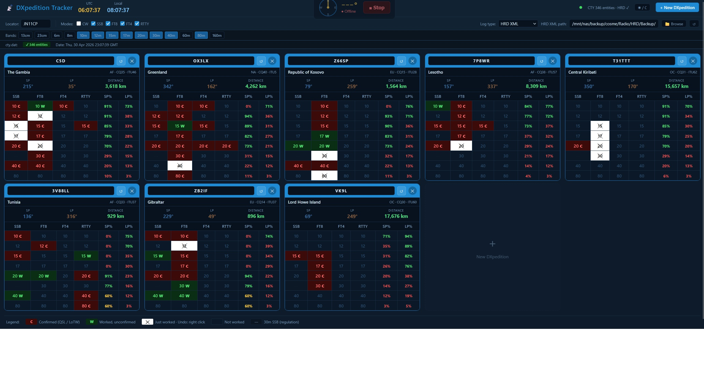

# DXpedition Tracker

> Web dashboard for DXpedition tracking with azimuth rotor control and multi-source log support.



---

## Features

- **DXpedition cards** — per-expedition tracking across bands (6m–160m) and modes (SSB, FT8, FT4, RTTY)
- **QSO status** — Confirmed (QSL/LoTW), Worked unconfirmed, Not worked — color-coded per cell. Status reflects your log history for the **DXCC entity**, not the specific DXpedition callsign
- **SP / LP bearings** — short path and long path per expedition, clickable to point the rotor
- **Distance** — calculated from your locator via cty.dat (346+ entities)
- **Rotor control** — ARS-USB (EA4TX) via GS-232A protocol, animated compass widget in topbar
- **Multi-source logs** — HRD XML, Swisslog MDB, Log4OM SQLite, ADIF
- **Propagation estimate** — real-time per-band score (0–99%) for SP and LP, based on live Kp (NOAA) and SFI (HamQSL), MUF model, solar hour at path midpoint, geomagnetic penalty and auroral zone detection
- **Drag & drop** — reorder expedition cards (SortableJS)
- **Two deployments** — Docker/NAS or standalone Windows .exe

---

## Log Sources

| Type | Extension | Selection |
|------|-----------|-----------|
| HRD XML | `.xml` | Folder — loads latest file automatically |
| Swisslog MDB | `.mdb` | Single file (Windows: app auto-detects and prompts to install Microsoft Access Database Engine if missing; Docker: uses mdbtools) |
| Log4OM SQLite | `.sqlite` / `.db` | Single file |
| ADIF | `.adi` / `.adif` | Single file |

---

## Rotor Control — ARS-USB (EA4TX)

- Protocol: Yaesu GS-232A
- Mechanical range: 0°–360°, hard stop at North — never crossed
- Direction: shortest arc avoiding the stop
- Position polling: 500 ms
- HTTP server on `localhost:8767`
- Auto-reconnect with exponential backoff (2 s → 60 s max) when ARS is off

---

## Deployment — Docker / NAS

### Requirements

- Docker + Docker Compose
- NAS or Linux host
- Windows PC with ARS-USB connected (for rotor, optional)

### Quick start

1. Copy `docker/docker-compose.yml` to your NAS
2. Edit the volume paths to match your setup
3. Run:

```bash
docker compose up -d
```

Dashboard available at `http://<host-ip>:8766`

### docker-compose.yml

```yaml
services:
  dxtracker:
    image: ea3tb/dxpedition-tracker:latest
    container_name: dxpedition_tracker
    restart: unless-stopped
    ports:
      - "8766:8766"
    volumes:
      # Data directory (config, expeditions, cty.dat)
      - /your/nas/path/Dxpedition_Dashboard:/opt/Dxpedition_Dashboard
      # NAS disk — read-only access to log files
      - /your/nas/path:/mnt/nas:ro
      # Optional: mount a shared folder from a Windows PC (SMB/CIFS)
      # - pc_logs:/mnt/pc_logs:ro
    environment:
      - DATA_DIR=/opt/Dxpedition_Dashboard
      - PORT=8766
    networks:
      - dx_net

networks:
  dx_net:
    driver: bridge

# volumes:
#   pc_logs:
#     driver: local
#     driver_opts:
#       type: cifs
#       device: "//192.168.X.X/SharedFolderName"
#       o: "guest,uid=1000,gid=1000,iocharset=utf8,vers=2.0"
```

### Rotor Tray (Docker users)

The rotor runs as a Windows tray app on the PC connected to the ARS-USB.

1. Copy the `rotor_tray/` folder to your Windows PC
2. Run `install_tray.bat` as Administrator
3. Enter the COM port of your ARS-USB when prompted
4. A tray icon appears — green=online, yellow=connecting, red=offline

Tray autostart is configured automatically (Windows startup folder, no console window).  
To uninstall: run `uninstall_tray.bat` as Administrator.

---

## Deployment — Windows (.exe)

### Requirements

- Windows 10/11 x64

### Installation

1. Download `DXpeditionTracker.exe` from [Releases](../../releases)
2. Run it — the dashboard opens automatically in your default browser
3. The rotor tray icon appears in the system tray

No installation required. Data is stored in `%APPDATA%\DXpeditionTracker\`.

### Build from source

```bat
cd windows\
BUILD_WINDOWS.bat
```

Requires Python 3.12 and PyInstaller. Produces two executables:
- `DXpeditionTracker.exe` — main dashboard
- `rotor_tray_exe.exe` — rotor tray (launched automatically)

---

## Ports

| Port | Service |
|------|---------|
| 8766 | Dashboard (FastAPI) |
| 8767 | Rotor HTTP server |

---

## Documentation

- [English Manual](docs/dxpedition_manual_eng.html)
- [Spanish Manual / Manual en Español](docs/dxpedition_manual_spa.html)

---

## Stack

- **Backend**: FastAPI + uvicorn (Python 3.12)
- **Frontend**: Vanilla HTML/JS, SortableJS
- **Rotor**: pyserial, pystray, Pillow
- **Docker base**: python:3.12-slim + mdbtools

---

## License

MIT — see [LICENSE](LICENSE)

---

*de EA3TB*
